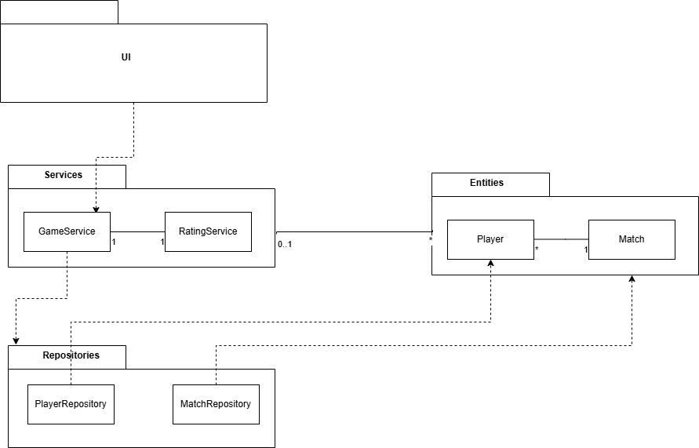
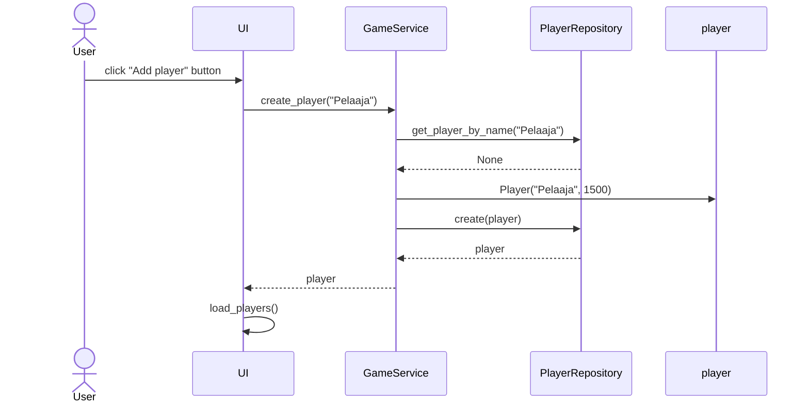

## Arkkitehtuuri

### Rakenne
Ohjelma on noudattaa kerrosarkkitehtuuria ja on rakennettu kolmeen tasoon. Koodin pakkausrakenne:

UI vastaa käyttöliittymästä, services vastaa sovelluslogiikasta, repositories vastaa tietojen tallennuksesta ja entities vastaa tietokohteista joita sovellus käyttää.

### Käyttöliittymä
Käyttöliittymä koostuu kolmesta erilaisesta näkymästä. 
- Players_view
- Match_view
- Match_history_view

Kaikki on toeutettu omina luokkinaan ja yleinen UI-luokka vastaa näkymien vuoroittaisesta näyttämisestä. Käyttöliittymä kutsuu GameService-luokan metodeja, joten se on eristetty sovelluslogiikasta.
Ensimmäisenä avautuu Players_view, joissa pelaajia voidaan lisätä järjestelmään ja uusia random joukkueita muodostaa handle_add_player ja handle_create_teams metodeilla. Nämä kutsuvat load_teams ja load_players metodeja, jotka renderöivät ne näymään.

Match_view näkymässä voidaan toteuttaa ottelu valitsemalla joukkueiden pelaajat ja asettamalla joukkueiden pisteet. Kun peli luodaan se kutsuu GameServicen metodia, joka käyttää RatingServicen metodeja laskeakseen rating muutokset.

Match_history_view voi toistaiseksi tarkastella edellisiä pelejä, niiden pelaajia ja joukkueiden pisteitä.

### Sovelluslogiikka 
Sovelluksen tietomallit muodostuvat Player ja Match olioista, jotka kuvastavat pelaajia ja otteluita. Pelaajilla on nimi ja rating, otteluilla on joukkueiden A ja B pelaajat sekä joukkueiden A ja B pisteet sekä id numero.

Sovelluksen toiminnoista vastaa GameService olio: Se tarjoaa metodeita kuten :
- create_player(name)
- get_all_players()
- create_random_teams(players, team_size)
- save_match_result(team_a_players, team_b_players, team_a_points, team_b_points)

GamesService käyttää ratingin laskemiseen RatingService oliota, joka tarjoaa logiikan Rating arvojen muutosten laskemiseen kun peli suoritetaan.

GameService pääsee käsiksi pelaajiin ja otteluihin luokkien PlayerRepository ja MAtchRepository avulla jotka vastaavat tietojen tallenuksesta, jotka injektoidaan GameServiceen sen luonnin yhteydessä.
Ohjelman osien suhdetta kuvaava Luokka- ja pakkauskaavio

### Tietojen pysyväistallennus
Repositories luokat MatchRepository ja PlayerRepository hoitavat tietojen tallennuksen SQLite- tietokantaan.
Nopudatetaan Repository-suunnittelumallia, joten tietojen tallennus on mahdollista korvata uudella tavalla suhteellisen vaivattomasti. Testauksessa, käytetään omaa SQLite- testitiedostoa.
Sovelluksen juuressa oleva .env tiedosto määrittelee data tiedoston nimen ja .env.test testauksessa käytettävän.
Pelaajat tallennetaan Players tauluun ja otteluita varten on Matches ja Match_players taulut. Nämä taulut alustetaan initialize_database.py tiedostosssa

## Sekvenssikaaviot

### Pelaajan luominen

