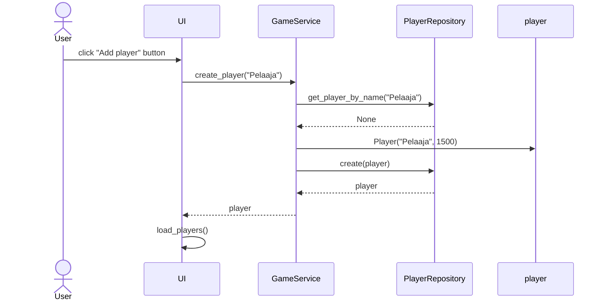

## Pakkausrakenne 

## Pakkaus- ja Luokkarakenne

## Sekvenssikaaviot

### Pelaajan luominen

```mermaid
sequenceDiagram
  actor User
  participant UI
  participant GameService
  participant PlayerRepository
  participant player
  User->>UI: click "Add player" button
  UI->>GameService: create_player("Pelaaja")
  GameService->>PlayerRepository: get_player_by_name("Pelaaja")
  PlayerRepository-->>GameService: None
  GameService->>player: Player("Pelaaja", 1500)
  GameService->>PlayerRepository: create(player)
  PlayerRepository-->>GameService: player
  GameService-->>UI: player
  UI->>UI: load_players()
```

