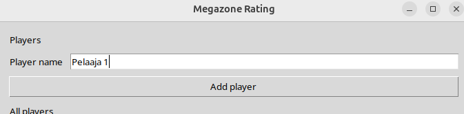
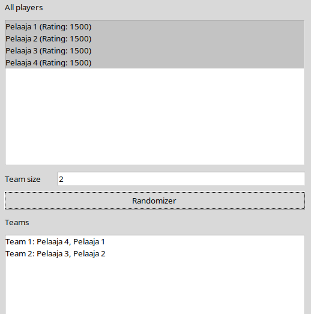
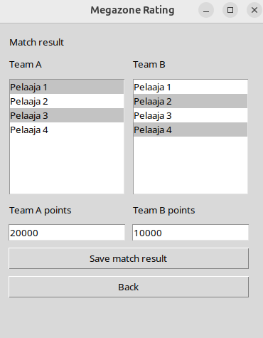
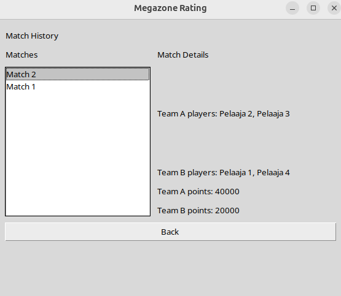

## Käyttöohje

### Ohjelman käynnistäminen 

1. Asenna riippuvuudet:
    ```bash
    poetry install

2. Alusta tietokanta ensimmäisellä kerralla:
    ```bash
    poetry run invoke build

3. Käynnistä sovellus:
    ```bash
    poetry run invoke start

### Pelaajan lisäys
Sovellus aukeaa pelaajanäymään jossa heti ylhäällä on pelaajan lisäys toiminto


Lisäys tapahtuu kirjoittamalla kenttään pelaajan nimi ja painamalla "Add player" painiketta.

### Satunnaisten joukkueiden luonti



Joukkueita luodaan valitsemalla halutut pelaajat pelaajalistalta ja asettamalla sen alapuolella olevaan kenttään joukkueiden haluttu koko. Painamalla painiketta "Randomizer", ohjelma jakaa valitut pelaaja satunnaisesti valitun kokoisiin joukkueisiin.

### Pelin luominen
Painamalla painiketta Record match result päästään uuteen näkymään 



Molemmista listoista valitaan halutut pelaajat (sama pelaaja ei voi olla molemmilla puolilla) ja asetetaan joukkueiden pisteet kenttiin. Painamalla painiketta "Save match result" peli tallentuu järjestelmään ja rating arvot muuttuvat järjestelmässä.

### Pelihistorian katsominen 



Painamalla "View match history" pääsee uuteen näkymään jossa on listattuna kaikki pelatut pelit. Valitsemalla pelin oikealla puolella näkyy kaikki tiedot kyseisestä pelistä.