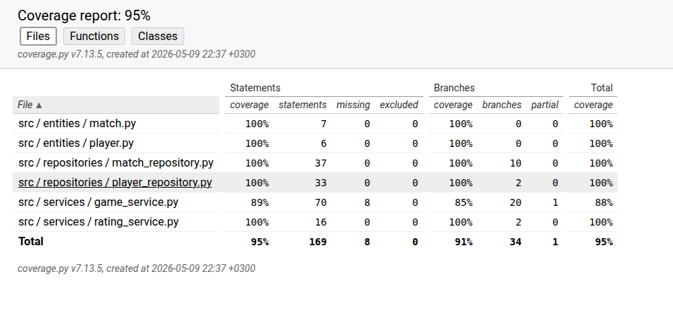

# Testausdokumentti

## Yksikkö- ja integraatiotestaus

### Sovelluslogiikka
Sovelluslogiikasta vastaavaa `GameService` ja `RatingService`- luokkia testataan [TestGameService](https://github.com/MiikkaVaa/ot-harjoitustyo/blob/master/src/tests/game_service_test.py)
ja [TestRatingService](https://github.com/MiikkaVaa/ot-harjoitustyo/blob/master/src/tests/rating_service_test.py)-luokilla.

`RatinService` hoitaa matemaattisen laskennan ratingarvoille, kun taas `GameService` kaiken muun kuten tietojen pysyväistallennuksen. `GameService` oliolle injektoidaan alustuksessa repositori-oliot. Testauksessa käytetään erillistä
datatiedostoa, joka on määritelty [.env.test](https://github.com/MiikkaVaa/ot-harjoitustyo/blob/master/.env.test)-tiedostossa.

### Repositorio-luokat 

Repositorio-luokat `MatchRepository` ja `PlayerRepository` testataan myös käyttäen testitiedostoja. Niitä testataan [TestMatchRepository](https://github.com/MiikkaVaa/ot-harjoitustyo/blob/master/src/repositories/match_repository.py)
ja [TestGameService](https://github.com/MiikkaVaa/ot-harjoitustyo/blob/master/src/tests/game_service_test.py) 

### Testauskattavuus

UI kerros poislukien testauskattavuus on 95%
Testaamatta jäivät kaikkien pelattujen pelien hakeminen sekä tarkistus onko joukkueissa sama pelaaja.

## Järjestelmätestaus
- Hoidettu manuaalisesti

