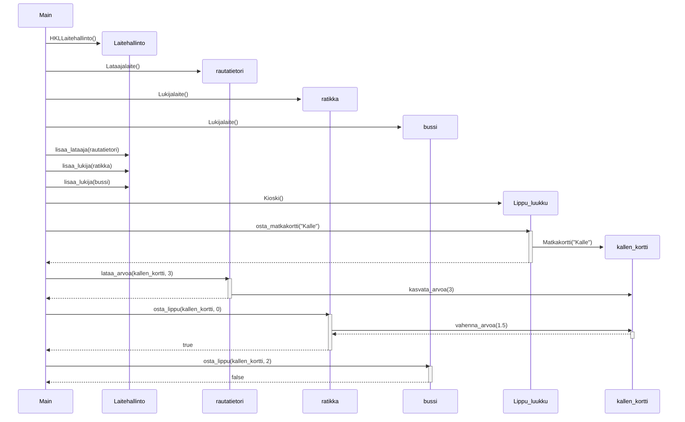

```mermaid
sequenceDiagram
   participant Main
   create participant Laitehallinto
   Main->>Laitehallinto: HKLLaitehallinto()
   create participant rautatietori
   Main->>rautatietori: Lataajalaite()
   create participant ratikka
   Main->>ratikka: Lukijalaite()
   create participant bussi
   Main->>bussi: Lukijalaite()
   Main->>Laitehallinto: lisaa_lataaja(rautatietori)
   Main->>Laitehallinto: lisaa_lukija(ratikka)
   Main->>Laitehallinto: lisaa_lukija(bussi)
   create participant Lippu_luukku
   Main->>Lippu_luukku: Kioski()
   Main->>Lippu_luukku: osta_matkakortti("Kalle")
   activate Lippu_luukku
   create participant kallen_kortti
   Lippu_luukku->>kallen_kortti: Matkakortti("Kalle")
   Lippu_luukku-->>Main:
   deactivate Lippu_luukku

   Main->>rautatietori: lataa_arvoa(kallen_kortti, 3)
   activate rautatietori
   rautatietori->>kallen_kortti: kasvata_arvoa(3)
   rautatietori-->>Main:
   deactivate rautatietori

   Main->>ratikka: osta_lippu(kallen_kortti, 0)
   activate ratikka
   ratikka->>kallen_kortti: vahenna_arvoa(1.5)
   activate kallen_kortti
   kallen_kortti-->>ratikka:
   deactivate kallen_kortti
   ratikka-->>Main: true
   deactivate ratikka

   Main->>bussi: osta_lippu(kallen_kortti, 2)
   activate bussi
   bussi-->>Main: false
   deactivate bussi
```
